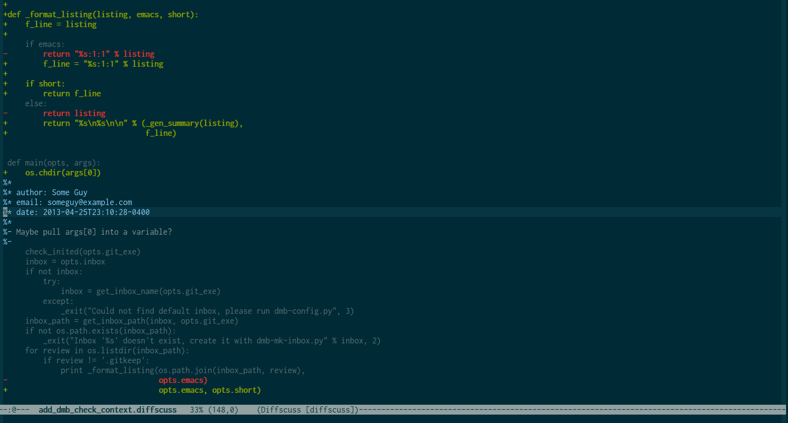
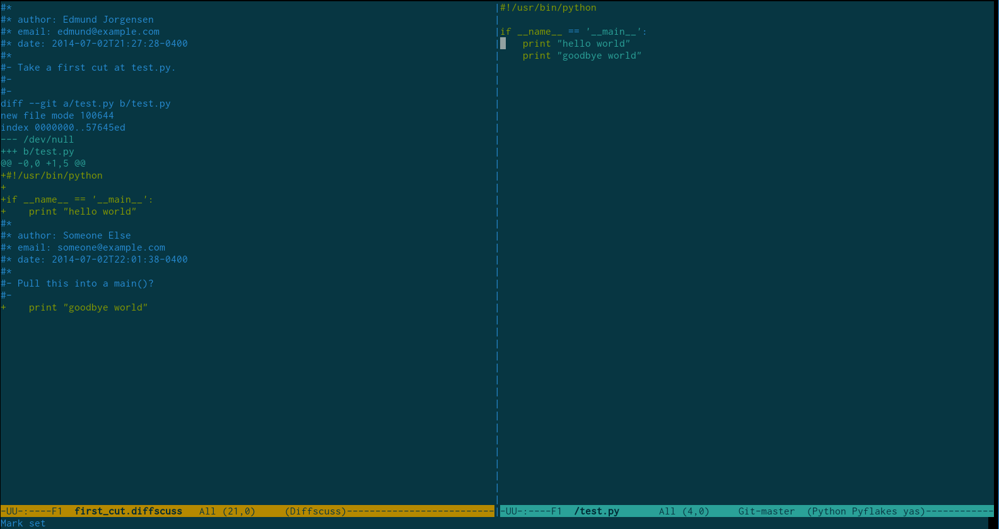

# Diffscuss: Code Reviews.  In Plain Text.

## What is Diffscuss?

Diffscuss is:

* a file format, built on the the unified diff format, that allows
  threaded code reviews to exist inline with the diffs they address

* an Emacs mode and Vim plugin to support responding to / managing
  code reviews in that format (including jumping directly to the
  source code a comment addresses)

* a set of command line tools to support generating and managing
  reviews in the diffscuss format with a simple, directory based tool
  for posting and managing code reviews

We at Hut 8 Labs originally developed diffscuss to help us do code
reviews when we were onsite with a client who didn't have their own
code review system.  We found ourselves emailing diffs back and forth,
writing things like "about halfway through the diff you do X, maybe
you should do Y?"  Eventually we started writing comments right in the
diffs themselves, with markers like "EWJ REVIEW!!!" and thought "There
has to be a better way."

Now, about 6 months into using diffscuss, we've grown to love its
support for code reviews in our editors--where we're already efficient
at reading and navigating code--and especially its abililty to jump
directly from a comment to the corresponding line of actual source,
which lowers the activation energy for addressing reviews and actually
making all those little suggested improvements.

## Why Might You Want to Use Diffscuss?

* you like the idea of reading and responding to code reviews right in
  your editor

* you want to lower the activation energy needed to apply small fixes
  and suggestions (jump right to the source with a single key combo!
  make the change!  jump right back!)

* you like the idea of keeping your reviews in your repo, right next
  to your code, or emailing them back and forth if you're just a
  couple hackers working on something and that's easier

* you like the idea of using grep and all the rest of that unix-y
  toolchain goodness on your reviews

## Why Shouldn't You Use Diffscuss?

* you're a big team, or you have significant process around code
  reviews (e.g. you have automated restrictions for review-then-commit
  workflows)

* you're not using git (for the moment, diffscuss is tightly
  integrated with git)

* you're not using Emacs or Vim (for the moment, those are the two
  editors with diffscuss tooling support)

## What Does a Diffscuss Review Look Like?

Screenshot of a Diffscuss review in Emacs:



After jumping to source:



## Getting Started

### Install the diffscuss exe

Diffscuss is a set of python utils wrapped in a single exe.  You can
either get the latest source from github and run run ```setup.py
install```, or you can grab the latest release from pypi with
```easy_install diffscuss``` or ```pip install diffscuss```.

### Install the Emacs mode or Vim plugin

(see below for details and some orientation)

You can now go bare bolts and just open up any unified diff file to
start reviewing, or you can...

### Generate a diffscuss review.

Use ```diffscuss generate``` from within a git repo to generate a new
review.  The only required argument is the revision range to construct
the review from, which is passed through as is to git and can
therefore be in any format recognized by git log
(e.g. ```HEAD^..HEAD``` is a common one).

By default all the commit messages within the range will be collected
into the initial review comment, and the author will be the value of
the ```user.name``` git config setting.

### Set up simple code review management

Diffscuss supports an extremely basic per-user "inbox" for incoming
code reviews.

These inbox are just directories, and reviews are "added to" an inbox
by creating a symbolic link to a diffscuss file (which is kept in a
per-repo "diffscussions" directory).

To get started, run ```diffscuss mailbox init``` (or run with -h to
see help).  This will create (by default) a .diffscuss-mb file and a
"diffscussions" directory at the top level of your repo, both of which
should be added to source control.

Next you'll want to create an inbox per user, with ```diffscuss
mailbox make-inbox <user-name>```, which will create an inbox under
"diffscussions/users/<user-name>".

Finally, so that you can check your inbox for new reviews, you'll want
to tell diffscuss which inbox should be considered yours by running
```diffscuss mailbox set-default-inbox <your-user-name>```.  This
creates a config variable called diffscuss-mb.inbox in your local git
config and sets it to the user name you supplied.

### Use simple code review management

Under ```diffscuss mailbox``` There is support for posting reviews,
marking them done (which just translates to removing symlinks in user
directories), and "bouncing" reviews, which means marking your review
done and asking someone else to take a look (e.g., because you made
comments that you want the original poster to implement / respond to).

Use ```diffscuss mailbox -h``` and ```diffscuss mailbox <subcommand>
-h``` for arguments and options to run from the command line.

The Emacs and Vim modes also have support for checking your mailbox,
posting, bouncing, and marking reviews done right from your editor.

In Emacs:

* ```C-c m p``` prompts for recipients and posts the current Diffscuss
  file for their review

* ```C-c m b``` prompts for recipients and bounces the review to them,
  removing the review from your inbox.

* ```C-c m d``` marks the review as done, removing it from your inbox.

* ```M-x diffscuss-mb-check``` checks your inbox and lists all
  incoming reviews.  You may wish to bind it globally to ```C-c m c```
  with:

```
(global-set-key "\C-cmc"  'diffscuss-mb-check)
```

In Vim:

* ```<leader>mp``` prompts for recipients and posts the current Diffscuss
  file for their review

* ```<leader>mb``` prompts for recipients and bounces the review to them,
  removing the review from your inbox.

* ```<leader>md``` marks the review as done, removing it from your inbox.

* ```<leader>mc``` opens a preview window with a list of all incoming
  reviews in your inbox. You can use ```gf``` with your cursor on a
  filename in the list to open the review (or e.g. ```C-w gf``` to open it
  in a new tab).

## Getting help

The diffscuss exe has help available with -h globally and for each
subcommand.

## The Format in a Nutshell

Diffscuss adds a single beginning-of-line character to the unified
diff format: %, which marks the beginning of a comment line.  Lines
beginning with %* are comment headers, and lines beginning with %- are
comment bodies.  The number of * or - characters indicates reply
threading.

Comments apply to the line directly above them.  Comments at the top
of the file apply to the entire review in general.

Take a look at the "Format Definition" section for (much) more detail.

## The Emacs Mode

The Emacs mode is implemented in a single .el file, diffscuss-mode.el.
To install, either move the diffscuss-mode.el file to a directory in
your load path or else add the Diffscuss mode directory to your load
path in your .emacs file like so:

```
(setq load-path
      (append (list nil "/path/to/diffscuss/diffscuss-mode")
               load-path))
```

Once the file is in your load path, require the mode with:

```
(require 'diffscuss-mode)
```

The mode colorizes Diffscuss files to make for easier reading.  In
addition it helps with:

### Inserting Comments

The main command you need to know is ```C-c C-c```, which generally
"does the right thing" based on the position of the cursor.  To wit:

* If the cursor is at the very top of the buffer, it will insert a new
  review-level comment (this function is available anywhere in the
  buffer with ```C-c C-f```).

* If the cursor is inside another comment, it will create a reply to
  that comment (this can also be invoked with ```C-c C-r```).

* If the cursor is inside the diff index information for a file /
  hunk, it will insert a comment after the "range line" (the line
  beginning with @@).

* If the cursor is on a diff line, it will create a comment directly
  below that line (this is also available with ```C-c C-i```).

### Jumping to Source

This currently requires that the Diffscuss file you are visiting is
somewhere under a git checkout of the repo against which the Diffscuss
file was generated.

#### Local Source

If you position the cursor on one of the diff lines in a Diffscuss
file, then:

* ```C-c s``` will attempt to find the local source file / line in
  that file that's the best candidate to match up with the Diffscuss
  line the cursor is currently on.

#### Repository Versions of the Source

* ```C-c -``` will open up a temporary buffer containing the old
  version of the source (if it's available locally), with the cursor
  positioned on the same line.

* ```C-c +``` will open up a temporary buffer containing the new
  version of the source (if it's available locally), with the cursor
  positioned on the same line.

### Navigation

You can move around the Diffscussion quickly using:

* ```C-c f``` to move forward one comment.

* ```C-c b``` to move back one comment.

* ```C-c n``` to move to the next thread.

* ```C-c p``` to move to the previous thread.

* ```C-c a``` to move to the beginning of the current thread.

* ```C-c e``` to move to the end of the current thread.

## The Vim Plugin

Like the Emacs mode, the Vim plugin offers syntax highlighting, comment insertion,
commands for jumping to source files, and motions for comments and threads.
The Vim plugin is implemented primarily in Python, so you'll need a version of
Vim compiled with Python support in order to use it
(```vim --version | grep '+python'```).

### Installation

#### With Vundle

If you use Vundle, add this to your `.vimrc` and then `:BundleInstall`:

```
Bundle 'hut8labs/diffscuss', {'rtp': 'diffscuss.vim/'}
```

#### With Pathogen

If you use Pathogen:

1. Clone the `diffscuss` repository.
2. Copy `diffscuss/diffscuss.vim` to `~/.vim/bundle`.
3. Set the `diffscuss_dir` key of `g:diffscuss_config` to the path of the
   `diffscuss` clone.

### Configuration

The Vim plugin will use its environment and `git config` to determine your name
and email (for pre-filling comments) and for various runtime paths.

If you wish, you can override these settings by specifying some or all of a
`g:diffscuss_config` dictionary in your `.vimrc`:

```vim
let g:diffscuss_config = {
    \'author': 'Your Name',
    \'email': 'your.email@example.com',
    \'diffscuss_dir': '/path/to/diffscuss',
    \'python': '/path/to/python'
    \}
```

### Inserting Comments

* `<leader>dd`: insert a new comment contextually (Emacs `C-c C-c`)
* `<leader>df`: insert a new review-level comment (Emacs `C-c C-f`)
* `<leader>dr`: insert a new reply (Emacs `C-c C-r`)
* `<leader>di`: insert a new comment (Emacs `C-c C-i`)

### Showing the Source

* `<leader>do`: show the old source version (Emacs `C-c -`)
* `<leader>dn`: show the new source version (Emacs `C-c +`)
* `<leader>ds`: show the local source version (Emacs `C-c s`)

### Navigation

* `]d`: jump to the start of the next comment
* `[d`: jump to the start of the previous comment
* `]D`: jump to the end of the next comment
* `[D`: jump to the end of the previous comment
* `]t`: jump to the start of the next thread
* `[t`: jump to the start of the previous thread
* `]T`: jump to the end of the next thread
* `[T`: jump to the end of the previous thread

## Pull Request Export (Experimental)

Diffscuss ships with an experimental ```diffscuss github-import```
command, which imports or more Github pull requests into local
Diffscuss files.

One possible use for this (besides transition, if you're going to use
Diffscuss), is to provide a searchable, offline copy of your pull
requests.

There's some talk about making this bidirectional, so that, e.g., you
could import a pull request, make local responses in diffscuss, and
push the changes, but for the moment it's just talk.  Let us know if
you'd be interested in this (or interested in helping write it!).

## What Else the Future Might Hold

* Side-by-side diff viewing in the modes

* Svn support

* Support for Sublime

* Support for Eclipse

* Support for other editors

* Export from ReviewBoard / other code review systems

* Imports into various code review systems (Diffscuss as code review interchange)

If any of these appeal to you / scratch a personal itch, please let us
know--or even better, contribute!

## Format Definition in Hairy Detail

### Beginning of Line Marker

All Diffscuss lines begin with one '%'.

There's no limit to the length of a Diffscuss line, but keeping them
80 chars or less when possible is probably good citizenship, since
they're meant to be read and edited inside editors.

### Diffscuss Comment Format

A Diffscuss comment begins with an author line, and possibly other
header lines, followed by at least one body line.

### Header Lines

A header line one '%' followed by at least one '*', followed by a
space, followed by a header of the format 'field-name: value'.

Header lines may also be empty, containing no 'field-name: value', in
which case the space after the * is also optional.

A header line must always begin a comment or follow another header
line.

For example, all three of these are valid header lines:

```
%* author: Bob Jones
```

```
%**
```

```
%*** x-github-version: 1
```

The field name cannot contain whitespace.  The value cannot contain a
newline.

The current Diffscuss headers are:

* author

* email

* date

Non-standard headers should begin with an 'x-', to keep compatible
with future additions to the Diffscuss format (for example, this is
what the github import uses).

#### The author Header

An author line is a standard header line with a field of 'author' and
a value indicating who authored the comment.  For example:

```
%* author: ejorgensen
```

Or

```
%** author: bsmith
```

Every comment must begin with an author line.  All other headers are
optional.

#### The date Header

Dates should be specified in the full ISO 8601 standard, including
time zone offset, e.g. 2013-11-22T23:11:21-0400.

### Body Lines

A body line is one '%' character followed by at least one -, followed
by a space, followed by arbitrary text.

Exception: for an empty body line, the space is optional.

For example:

```
%- This is a body line.
```

```
%-- And so is *this*.
```

```
%- and this next body line
%-
%- is empty, so doesn't need a space, but could have one.
```

A body line must always follow a header line or another body line.

### Threads

A thread is one or more adjacent comments, properly threaded.

For example, this is a thread:

```
%* author: ejorgensen
%- I'm a one comment thread.
```

And so is this:

```
%* author: ejorgensen
%- I'm a two comment thread.
%* author: bsmith
%- With no replies, just two top level comments.
```

And so is this:

```
%* author: ejorgensen
%- I'm a two comment thread.
%** author: bsmith
%-- With a reply.
```

To be explicit: the nesting / reply level of a thread is determined by
the number of '*' characters in each header line / '-' characters in
each body line, which should remain constant for a given comment.

A comment that is a reply to a previous comment should have one more
'*' at the beginning of each header line and one more '-' at the
beginning of each body line than its parent comment.

The parent comment for any reply can always be determined by finding
the closest previous comment with one less level of nesting.  For
example:

```
%* author: ejorgensen
%- I'm a top-level comment.
%** author: bsmith
%-- And I'm a reply.
%*** author: sjones
%--- And I'm a reply to the reply.
%** author: jkidd
%-- And I'm a second reply to the original top-level comment.
%* author: mdarks
%- And I'm another top-level comment.
%** author: lbutterman
%-- And I'm a reply to the second top-level comment.
```
#### Position / Target of Threads

Diffscuss threads are generally taken to apply to the line immediately
above them, so for example in this snippet:

```
+It's only just a test
%* author: ejorgensen
%- I have grave doubts about this change.  To me it appears foolhardy
%- and dangerous.
```

The comment applies to the line

```
+It's only just a test
```

A Diffscuss thread can also appear directly after the range
information in a hunk, in which case the target of the comment is
assumed to be the entire hunk, for example:

```
--- 1.txt	2013-03-07 20:18:10.000000000 -0500
+++ 2.txt	2013-03-07 20:18:35.000000000 -0500
@@ -1,5 +1,7 @@
%* author: ejorgensen
%- I love this hunk.
 This is a test.

-It's just a test
+It's only just a test
```

Finally, if a thread appears at the very top of the Diffscuss file,
the thread applies to the whole changeset (where it should generally
act as a thread discussing the review as a whole--for example,
introductory remarks about what the changes are attempting to achieve,
"ship it" remarks, etc.).

Every Diffscuss file must begin with such a changeset level thread
(optionally preceded by any number of "magic" comment lines, e.g. "#
-*- coding: utf-8 -*-").
